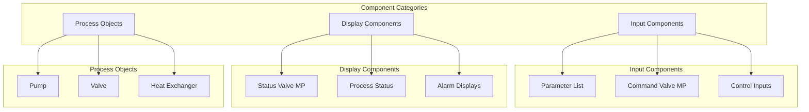

# Component Development Milestones

This milestone focuses on building the core HMI components for the Dairy Industry, including input controls, display elements, and process objects.

## Phase Overview

**Timeline:** Q1 - Q2 2025  
**Status:** 🚧 In Progress  
**Key Focus:** Component Implementation & User Interface

## Component Architecture



## Milestone Goals

### 1. Input Components 🚧 IN PROGRESS

**Target Date:** February 28, 2025  
**Status:** 🚧 In Progress

#### Parameter List Component
- [x] Component schema definition
- [x] Basic React component structure
- [ ] Props validation and TypeScript types
- [ ] Event handling for parameter changes
- [ ] Designer property panel integration
- [ ] Documentation and examples

#### Command Valve MP Component
- [x] Component schema definition  
- [ ] Multi-position valve control interface
- [ ] Command execution and feedback
- [ ] Safety interlocks and validation
- [ ] Visual state indicators
- [ ] Designer integration

#### Control Input Components
- [ ] Numeric input with validation
- [ ] Text input with constraints
- [ ] Boolean toggle controls
- [ ] Dropdown selection controls
- [ ] Date/time picker components

### 2. Display Components 📋 PLANNED

**Target Date:** March 31, 2025  
**Status:** 📋 Planned

#### Status Valve MP Component
- [ ] Multi-position valve status display
- [ ] Real-time state visualization
- [ ] Alarm and warning indicators
- [ ] Historical trend integration
- [ ] Responsive design implementation

#### Process Status Displays
- [ ] Equipment status overview
- [ ] Performance metrics dashboard
- [ ] Alarm summary component
- [ ] Process flow visualization
- [ ] Data logging integration

### 3. Process Objects 📋 PLANNED

**Target Date:** April 30, 2025  
**Status:** 📋 Planned

#### Pump Component
- [ ] Pump status and control interface
- [ ] Performance monitoring
- [ ] Start/stop controls with safety
- [ ] Vibration and temperature monitoring
- [ ] Maintenance scheduling integration

#### Valve Component
- [ ] Standard valve control and status
- [ ] Position feedback display
- [ ] Manual/automatic mode switching
- [ ] Fault detection and reporting
- [ ] Calibration interface

#### Heat Exchanger Component
- [ ] Temperature monitoring display
- [ ] Flow rate indicators
- [ ] Efficiency calculations
- [ ] Fouling detection alerts
- [ ] Cleaning cycle management

## Technical Implementation

### Component Structure

Each component follows the standard Perspective component pattern:

```typescript
// Component Props Interface
interface ComponentProps {
    store: ComponentStore;
    config: ComponentConfig;
    // Component-specific props
}

// React Component
export class HMIComponent extends Component<ComponentProps> {
    // Component implementation
}

// Component Registration
ComponentRegistry.register(
    "hmi.component.name",
    HMIComponent,
    componentSchema
);
```

### Schema Definition Pattern

```json
{
    "type": "object",
    "properties": {
        "value": {
            "type": "any",
            "description": "Current component value"
        },
        "enabled": {
            "type": "boolean",
            "default": true
        },
        "style": {
            "$ref": "#/definitions/style"
        }
    }
}
```

## Quality Standards

### Component Requirements

Each component must meet these criteria before completion:

1. **Functionality:**
   - ✅ Core functionality implemented
   - ✅ Error handling and validation
   - ✅ Event system integration
   - ✅ Performance optimization

2. **User Experience:**
   - ✅ Intuitive interface design
   - ✅ Responsive behavior
   - ✅ Accessibility compliance
   - ✅ Consistent styling

3. **Integration:**
   - ✅ Designer property panel
   - ✅ Gateway data binding
   - ✅ Event handling
   - ✅ Documentation complete

4. **Testing:**
   - ✅ Unit tests written
   - ✅ Integration tests pass
   - ✅ User acceptance testing
   - ✅ Performance benchmarks

## Progress Tracking

### Current Sprint (January 2025)
- [x] Parameter List component schema
- [x] Command Valve MP component foundation
- [ ] TypeScript type definitions
- [ ] Event handling implementation
- [ ] Property panel configuration

### Next Sprint (February 2025)
- [ ] Complete Parameter List component
- [ ] Command Valve MP functionality
- [ ] Begin display components
- [ ] Component testing framework
- [ ] Documentation updates

## Dependencies & Blockers

### External Dependencies
- ✅ Ignition 8.1.44+ compatibility
- ✅ React 18+ support
- 🚧 Component library design system
- 📋 Testing framework setup

### Current Blockers
- 🚧 Component styling guidelines need finalization
- 📋 Performance testing infrastructure setup
- 📋 Designer integration testing environment

## Success Metrics

### Component Quality Metrics
- **Code Coverage:** Target 90%+
- **Performance:** < 100ms render time
- **Bundle Size:** < 50KB per component
- **Accessibility:** WCAG 2.1 AA compliance

### User Experience Metrics
- **Usability Testing:** 95% task completion rate
- **Error Rate:** < 2% user errors
- **Learning Curve:** < 30 minutes to proficiency
- **Satisfaction Score:** 4.5/5 average rating

---

**Previous:** [Foundation Milestones](./foundation-milestones) | **Next:** [Integration Milestones](./integration-milestones)