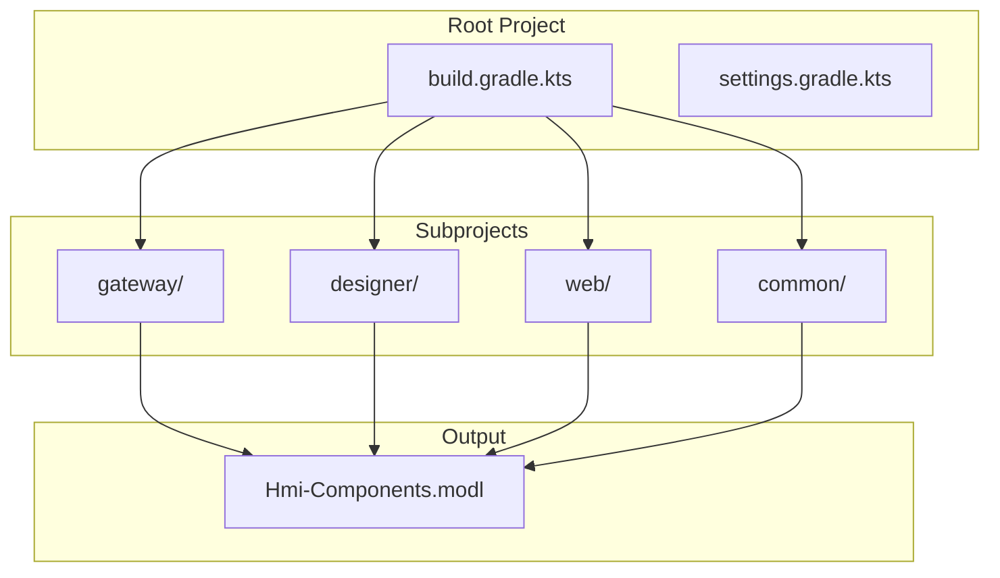

# Foundation Milestones

This milestone focuses on establishing the development infrastructure, project structure, and essential tooling for the HMI Component Library.

## Phase Overview

**Timeline:** Q4 2024 - Q1 2025  
**Status:** ✅ Completed  
**Key Focus:** Infrastructure & Development Environment

## Milestone Goals

### 1. Project Setup ✅ COMPLETED

**Target Date:** December 31, 2024  
**Status:** ✅ Completed

#### Objectives:
- [x] Initialize Git repository
- [x] Set up Gradle build system with Kotlin DSL
- [x] Configure Ignition Module SDK
- [x] Establish project structure (gateway, designer, web, common)
- [x] Create initial module configuration

#### Deliverables:
- ✅ `build.gradle.kts` with module configuration
- ✅ Multi-project Gradle setup
- ✅ Basic project scopes (Gateway, Designer, Common)
- ✅ Module metadata and version management

### 2. Documentation Framework ✅ COMPLETED

**Target Date:** January 15, 2025  
**Status:** ✅ Completed

#### Objectives:
- [x] Set up Docusaurus documentation site
- [x] Configure GitHub Pages deployment
- [x] Create documentation structure
- [x] Add Keith Gamble's example guide integration
- [x] Set up automated documentation deployment

#### Deliverables:
- ✅ Docusaurus configuration with TypeScript
- ✅ Automated GitHub Actions deployment
- ✅ Documentation sections for different guides
- ✅ Mermaid diagram support for technical docs

### 3. Development Environment 🚧 IN PROGRESS

**Target Date:** February 28, 2025  
**Status:** 🚧 In Progress

#### Objectives:
- [ ] Docker development environment setup
- [x] IDE configuration (VS Code/IntelliJ)
- [ ] Hot reload development workflow
- [ ] Code quality tools (ESLint, Prettier)
- [ ] Git hooks and pre-commit checks

#### Current Progress:
- ✅ Basic IDE support configured
- 🚧 Docker environment configuration
- 📋 Development workflow optimization

## Technical Specifications

### Build System Architecture



### Module Configuration

```kotlin
ignitionModule {
    name.set("HMI Components")
    fileName.set("Hmi-Components.modl")
    id.set("dev.aflittlejohns.perspective.hmi.Components")
    moduleVersion.set("${project.version}")
    
    projectScopes.putAll(mapOf(
        ":gateway" to "G",
        ":web" to "G",
        ":designer" to "D",
        ":common" to "GD"
    ))
}
```

## Quality Gates

### Definition of Done

For this milestone to be considered complete, all deliverables must meet:

1. **Build System:**
   - ✅ Clean builds without errors
   - ✅ Proper dependency management
   - ✅ Module packaging works correctly

2. **Documentation:**
   - ✅ Automated deployment to GitHub Pages
   - ✅ All sections accessible and formatted correctly
   - ✅ Mermaid diagrams render properly

3. **Development Setup:**
   - 🚧 Docker environment functional
   - 📋 Code quality tools integrated
   - 📋 Development workflow documented

## Lessons Learned

### What Went Well
- Gradle with Kotlin DSL provides excellent type safety
- Docusaurus integration was straightforward
- GitHub Actions deployment pipeline works reliably

### Challenges Faced
- Module SDK version compatibility issues
- Documentation cross-references needed careful planning
- Development environment standardization ongoing

## Next Steps

With the foundation in place, we can now focus on:

1. **Component Development:** Begin building core HMI components
2. **Testing Framework:** Establish automated testing
3. **CI/CD Pipeline:** Expand automation beyond documentation

---

**Previous:** [Project Milestones](./) | **Next:** [Component Development Milestones](./component-milestones)