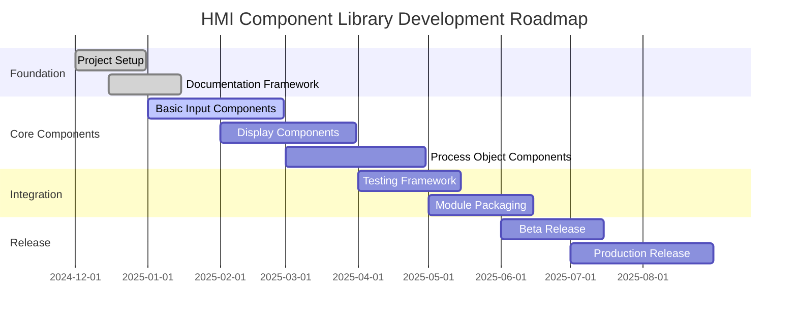

# Project Milestones & Roadmap

Welcome to the HMI Component Library project milestones! This section tracks our development progress, upcoming features, and long-term goals for building robust HMI components for the Dairy Industry.

## Current Status

**Project Version:** 0.0.1-SNAPSHOT  
**Phase:** Initial Development  
**Last Updated:** January 2025

## Quick Overview

## Development Phases

### Phase 1: Foundation (Q4 2024 - Q1 2025)
Setting up the development infrastructure and core framework.

### Phase 2: Core Components (Q1 - Q2 2025)
Building essential HMI components for the Dairy Industry.

### Phase 3: Advanced Features (Q2 - Q3 2025)
Adding sophisticated process control and monitoring capabilities.

### Phase 4: Production Ready (Q3 - Q4 2025)
Testing, optimization, and production deployment.

## Detailed Milestones

- [Foundation Milestones](./foundation-milestones) - Project setup and infrastructure
- [Component Development](./component-milestones) - Core component implementation
- [Integration Milestones](./integration-milestones) - Testing and module packaging
- [Release Milestones](./release-milestones) - Beta and production releases

## Progress Tracking

### Completed ✅
- [x] Project repository setup
- [x] Gradle build system configuration
- [x] Docusaurus documentation framework
- [x] Basic project structure
- [x] License and contributing guidelines

### In Progress 🚧
- [ ] Core input component development
- [ ] Parameter list component
- [ ] Command valve components
- [ ] Documentation content creation

### Upcoming 📋
- [ ] Display status components
- [ ] Process object components (pump, valve, heat exchanger)
- [ ] Component testing framework
- [ ] Module deployment pipeline

## Contributing to Milestones

Want to help achieve our milestones? Check out:

1. [Contributing Guide](../1-keith-gamble-example-docs/5-Contributing)
2. [Development Setup](../1-keith-gamble-example-docs/1-Getting%20Started/2-environment-setup)
3. [Component Development Guide](../1-keith-gamble-example-docs/4-Guides/1-Adding%20Components)

## Milestone Updates

Milestones are reviewed and updated monthly. For the latest status:

- Check our [GitHub Issues](https://github.com/aflittlejohns/ign-po-mod/issues)
- Review [Pull Requests](https://github.com/aflittlejohns/ign-po-mod/pulls)
- Join discussions in our project repository

---

**Next:** [Foundation Milestones](./foundation-milestones) - Detailed breakdown of our infrastructure goals