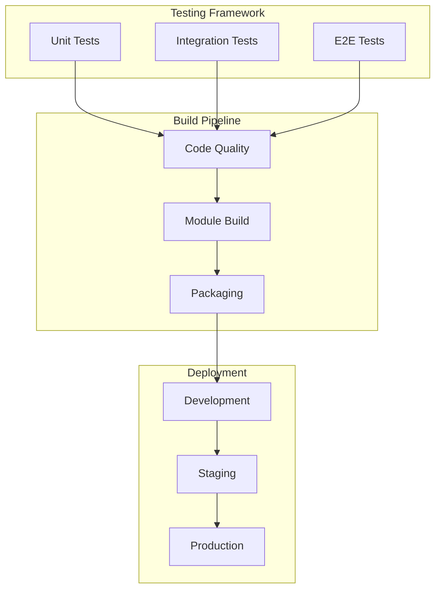

# Integration Milestones

This milestone focuses on testing frameworks, quality assurance, module packaging, and deployment preparation for the HMI Component Library.

## Phase Overview

**Timeline:** Q2 - Q3 2025  
**Status:** 📋 Planned  
**Key Focus:** Testing, Integration & Packaging

## Integration Architecture



## Milestone Goals

### 1. Testing Framework 📋 PLANNED

**Target Date:** May 15, 2025  
**Status:** 📋 Planned

#### Unit Testing Infrastructure
- [ ] Jest testing framework setup
- [ ] React Testing Library integration
- [ ] Component test utilities
- [ ] Mock data and fixtures
- [ ] Code coverage reporting

#### Integration Testing
- [ ] Component integration tests
- [ ] Gateway service testing
- [ ] Designer integration testing
- [ ] Property binding validation
- [ ] Event system testing

#### End-to-End Testing
- [ ] Cypress test framework setup
- [ ] User workflow automation
- [ ] Cross-browser testing
- [ ] Performance testing suite
- [ ] Accessibility testing

### 2. Quality Assurance 📋 PLANNED

**Target Date:** May 30, 2025  
**Status:** 📋 Planned

#### Code Quality Tools
- [ ] ESLint configuration and rules
- [ ] Prettier code formatting
- [ ] SonarQube integration
- [ ] Security vulnerability scanning
- [ ] Dependency audit automation

#### Performance Monitoring
- [ ] Bundle size analysis
- [ ] Runtime performance metrics
- [ ] Memory usage monitoring
- [ ] Component render profiling
- [ ] Load testing framework

#### Documentation Quality
- [ ] API documentation generation
- [ ] Component showcase examples
- [ ] Usage guidelines validation
- [ ] Tutorial completeness check
- [ ] Documentation testing

### 3. Module Packaging 📋 PLANNED

**Target Date:** June 15, 2025  
**Status:** 📋 Planned

#### Module Build System
- [ ] Gradle build optimization
- [ ] Resource bundling strategy
- [ ] Dependency management
- [ ] Version management automation
- [ ] Build artifact signing

#### Module Configuration
- [ ] Component registration optimization
- [ ] Resource path management
- [ ] Module metadata completion
- [ ] Dependency declaration
- [ ] Hook configuration validation

#### Distribution Preparation
- [ ] Module packaging verification
- [ ] Installation testing
- [ ] Upgrade path validation
- [ ] Documentation packaging
- [ ] Release notes automation

## Technical Implementation

### Testing Strategy

#### Component Testing Pattern
```javascript
// Example component test
describe('ParameterListComponent', () => {
    test('renders with default props', () => {
        const component = render(<ParameterListComponent {...defaultProps} />);
        expect(component.getByRole('listbox')).toBeInTheDocument();
    });
    
    test('handles parameter selection', async () => {
        const onSelect = jest.fn();
        const component = render(
            <ParameterListComponent onSelect={onSelect} {...defaultProps} />
        );
        
        await user.click(component.getByText('Parameter 1'));
        expect(onSelect).toHaveBeenCalledWith('Parameter 1');
    });
});
```

#### Integration Testing Approach
```javascript
// Gateway integration test
describe('Component Gateway Integration', () => {
    test('property updates propagate correctly', async () => {
        const gateway = new MockGateway();
        const component = new ComponentInstance(gateway);
        
        gateway.updateProperty('value', 42);
        await component.waitForUpdate();
        
        expect(component.getPropertyValue('value')).toBe(42);
    });
});
```

### Build Pipeline Configuration

#### CI/CD Pipeline
```yaml
# GitHub Actions workflow
name: Build and Test
on: [push, pull_request]

jobs:
  test:
    runs-on: ubuntu-latest
    steps:
      - uses: actions/checkout@v3
      - uses: actions/setup-node@v3
      - uses: actions/setup-java@v3
      
      - name: Install dependencies
        run: npm ci
        
      - name: Run tests
        run: npm run test:coverage
        
      - name: Build module
        run: ./gradlew build
        
      - name: Package module
        run: ./gradlew packageModule
```

## Quality Gates

### Testing Requirements

Each milestone phase must meet these quality standards:

1. **Code Coverage:**
   - Unit tests: 90%+ coverage
   - Integration tests: 80%+ coverage
   - E2E tests: 100% critical path coverage

2. **Performance Standards:**
   - Component load time: < 100ms
   - Module startup time: < 5 seconds
   - Memory usage: < 50MB per component

3. **Quality Metrics:**
   - Zero critical security vulnerabilities
   - SonarQube quality gate: PASSED
   - All accessibility tests: PASSED
   - Browser compatibility: IE11+, Chrome, Firefox, Safari

### Module Packaging Standards

1. **Module Structure:**
   - Valid module metadata
   - Proper component registration
   - Resource optimization
   - Documentation inclusion

2. **Installation Testing:**
   - Clean installation
   - Upgrade from previous versions
   - Dependency resolution
   - Gateway restart handling

## Risk Management

### Identified Risks

| Risk | Impact | Probability | Mitigation |
|------|---------|-------------|------------|
| Performance degradation | High | Medium | Continuous monitoring, performance budgets |
| Breaking changes in Ignition | High | Low | Version pinning, compatibility testing |
| Test infrastructure complexity | Medium | High | Incremental implementation, tool evaluation |
| Build pipeline failures | Medium | Medium | Redundant systems, automated rollback |

### Contingency Plans

1. **Performance Issues:**
   - Component lazy loading implementation
   - Bundle splitting strategies
   - Caching optimization

2. **Testing Challenges:**
   - Manual testing fallback procedures
   - Simplified test scenarios
   - Extended testing timeline

3. **Build Problems:**
   - Alternative build tool evaluation
   - Manual packaging procedures
   - Simplified module structure

## Success Metrics

### Testing Metrics
- **Test Execution Time:** < 10 minutes full suite
- **Flaky Test Rate:** < 5%
- **Bug Detection Rate:** 95% caught before release
- **Test Maintenance Effort:** < 20% of development time

### Quality Metrics
- **Defect Density:** < 1 defect per 1000 lines of code
- **Technical Debt Ratio:** < 5%
- **Security Vulnerability Count:** 0 high/critical
- **Performance Regression Rate:** < 2%

### Deployment Metrics
- **Module Size:** < 5MB total
- **Installation Success Rate:** 99%
- **Startup Time:** < 30 seconds
- **Resource Usage:** < 100MB memory

---

**Previous:** [Component Development Milestones](./component-milestones) | **Next:** [Release Milestones](./release-milestones)