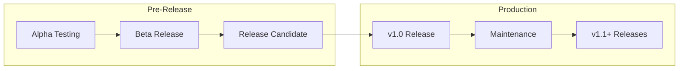
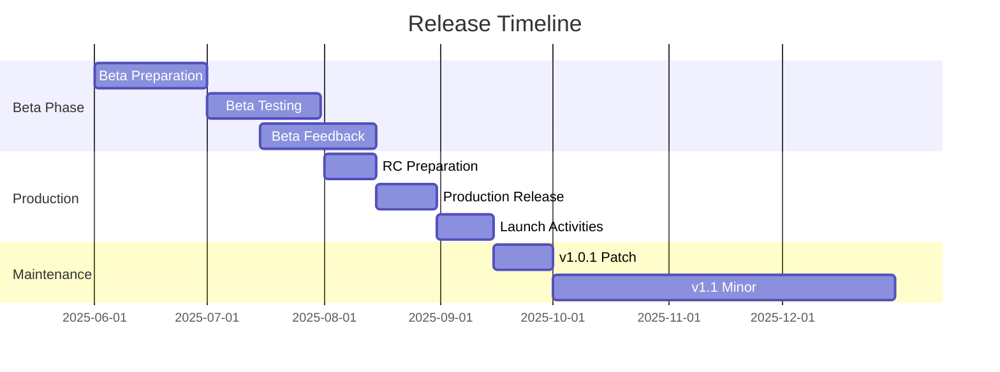

# Release Milestones

This milestone focuses on preparing for beta and production releases, including user testing, documentation finalization, and production deployment.

## Phase Overview

**Timeline:** Q3 - Q4 2025  
**Status:** 📋 Planned  
**Key Focus:** Release Preparation & Production Deployment

## Release Strategy

## Milestone Goals

### 1. Beta Release Preparation 📋 PLANNED

**Target Date:** July 15, 2025  
**Status:** 📋 Planned

#### Pre-Beta Requirements
- [ ] All core components feature-complete
- [ ] Integration testing 100% passed
- [ ] Performance benchmarks met
- [ ] Security audit completed
- [ ] Documentation 90% complete

#### Beta Release Scope
- [ ] Core input components (Parameter List, Command Valve MP)
- [ ] Essential display components (Status displays)
- [ ] Basic process objects (Pump, Valve)
- [ ] Complete installation package
- [ ] User documentation and tutorials

#### Beta Testing Program
- [ ] Recruit 10-15 beta testers from dairy industry
- [ ] Establish feedback collection system
- [ ] Create testing scenarios and guidelines
- [ ] Set up support channel for beta users
- [ ] Define success criteria for beta phase

### 2. Production Release 📋 PLANNED

**Target Date:** August 31, 2025  
**Status:** 📋 Planned

#### Production Readiness Criteria
- [ ] Zero critical or high severity bugs
- [ ] Performance requirements met
- [ ] Security certification completed
- [ ] Documentation 100% complete
- [ ] Support processes established

#### v1.0 Feature Set
- [ ] Complete HMI component library
- [ ] Full Ignition Perspective integration
- [ ] Comprehensive documentation
- [ ] Professional support offerings
- [ ] Migration tools and guides

#### Launch Activities
- [ ] Official announcement and marketing
- [ ] Community engagement program
- [ ] Training materials and webinars
- [ ] Partner integration support
- [ ] Industry conference presentations

### 3. Post-Release Support 📋 PLANNED

**Target Date:** Ongoing from September 2025  
**Status:** 📋 Planned

#### Maintenance & Updates
- [ ] Regular security updates
- [ ] Bug fix releases (monthly)
- [ ] Feature updates (quarterly)
- [ ] Compatibility updates for new Ignition versions
- [ ] Community contribution integration

#### Long-term Roadmap
- [ ] Advanced process control components
- [ ] Mobile-responsive optimizations
- [ ] Cloud integration features
- [ ] AI/ML-powered analytics components
- [ ] Industry-specific component packages

## Release Planning

### Version Numbering Strategy

Following semantic versioning (SemVer):

- **Major (1.0, 2.0):** Breaking changes, major new features
- **Minor (1.1, 1.2):** New features, backward compatible
- **Patch (1.0.1, 1.0.2):** Bug fixes, security updates

### Release Timeline

## Quality Assurance

### Release Testing Checklist

#### Functional Testing
- [ ] All components function as designed
- [ ] Integration with Ignition works correctly
- [ ] Property binding and events work properly
- [ ] Designer integration is seamless
- [ ] Gateway deployment succeeds

#### Performance Testing
- [ ] Component load times meet targets
- [ ] Memory usage within acceptable limits
- [ ] CPU utilization optimized
- [ ] Network bandwidth efficient
- [ ] Large dataset handling verified

#### Compatibility Testing
- [ ] Ignition 8.1.44+ compatibility verified
- [ ] Multiple browser testing completed
- [ ] Operating system compatibility confirmed
- [ ] Database integration tested
- [ ] Third-party module compatibility

#### Security Testing
- [ ] Vulnerability scanning completed
- [ ] Authentication integration verified
- [ ] Authorization controls tested
- [ ] Data encryption validated
- [ ] Audit logging functional

### User Acceptance Testing

#### Beta Testing Metrics
- **Target Participants:** 15 dairy industry professionals
- **Testing Duration:** 4-6 weeks
- **Success Criteria:** 
  - 90% satisfaction rating
  - < 5 critical issues identified
  - 100% installation success rate
  - Performance targets met

#### Feedback Collection
- [ ] Weekly surveys and interviews
- [ ] Bug reporting system
- [ ] Feature request tracking
- [ ] Performance feedback analysis
- [ ] Documentation feedback review

## Documentation & Training

### Release Documentation

#### User Documentation
- [ ] Installation and setup guide
- [ ] Component usage tutorials
- [ ] Best practices guide
- [ ] Troubleshooting manual
- [ ] API reference documentation

#### Developer Documentation
- [ ] Extension development guide
- [ ] Component customization manual
- [ ] Integration patterns
- [ ] Performance optimization guide
- [ ] Contribution guidelines

#### Training Materials
- [ ] Video tutorial series
- [ ] Interactive online training
- [ ] Webinar presentations
- [ ] Industry conference materials
- [ ] Partner training resources

### Support Infrastructure

#### Community Support
- [ ] GitHub discussions setup
- [ ] Community forum establishment
- [ ] FAQ knowledge base
- [ ] Video tutorial library
- [ ] Community moderator program

#### Professional Support
- [ ] Tiered support offerings
- [ ] Enterprise support packages
- [ ] Consulting services
- [ ] Custom development options
- [ ] Training and certification programs

## Success Metrics

### Release Success Indicators

#### Adoption Metrics
- **Download Count:** 1,000+ in first month
- **Active Installations:** 100+ production deployments
- **Community Engagement:** 50+ GitHub stars, 25+ discussions
- **Documentation Views:** 5,000+ page views

#### Quality Metrics
- **Bug Report Rate:** < 1 bug per 100 downloads
- **User Satisfaction:** 4.5/5 average rating
- **Performance Compliance:** 100% of benchmarks met
- **Support Response Time:** < 24 hours average

#### Business Metrics
- **Market Penetration:** 5% of target dairy industry
- **Partner Adoption:** 3+ system integrator partnerships
- **Revenue Impact:** $50K+ in professional services
- **Industry Recognition:** Featured in 2+ trade publications

### Long-term Success Factors

#### Product Evolution
- [ ] Regular feature updates based on user feedback
- [ ] Continuous performance improvements
- [ ] Expanding component library
- [ ] Industry trend adaptation
- [ ] Technology stack modernization

#### Community Growth
- [ ] Active contributor community
- [ ] Third-party extension ecosystem
- [ ] Industry partnership network
- [ ] Educational institution adoption
- [ ] International market expansion

---

**Previous:** [Integration Milestones](./integration-milestones) | **Next:** [Project Milestones](./)